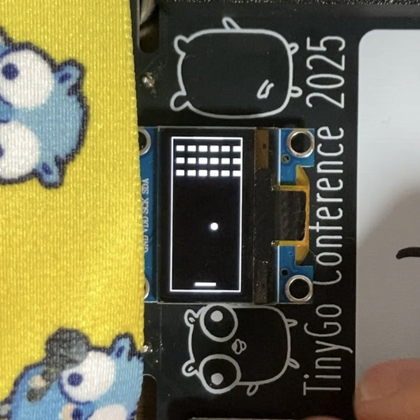
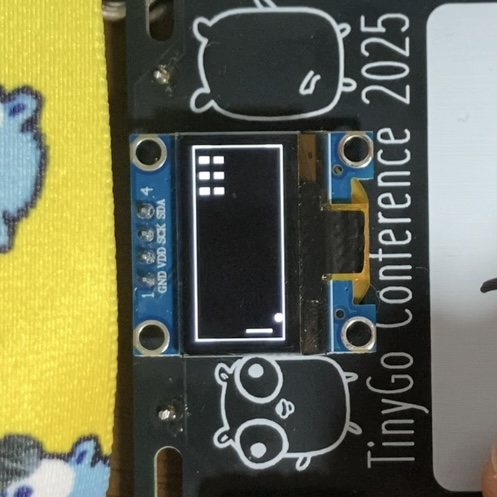
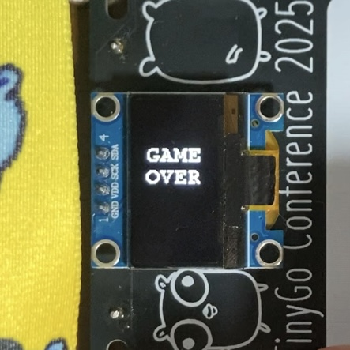

# Breakout

[koebiten](https://github.com/sago35/koebiten) を使用して実装したブロック崩しゲーム

## 概要

TinyGo + koebiten で動作するシンプルなブロック崩しゲームです  
conf2025badge 向けに作成しています  
他環境での動作は未検証

## ゲーム内容

- パドルを操作してボールを跳ね返し、ブロックを破壊する  
  - スタート画面  
      
  - ゲーム中の画面  
      
- ブザーによる効果音 (起動時、ゲームオーバー、クリア)  
  - 落下するとゲームオーバー  
      
  - 6x6 のブロックを全て破壊するとゲームクリア  
      

## 操作方法

| キー | 動作 |
|------|------|
| ↑ | パドルを左に移動 |
| ↓ | パドルを右に移動 |

## Flash

`src` ディレクトリに移動して以下のコマンドを実行してください

```bash
tinygo flash --target targets/conf2025badge.json --size short .
```

## ライセンス

MIT License
